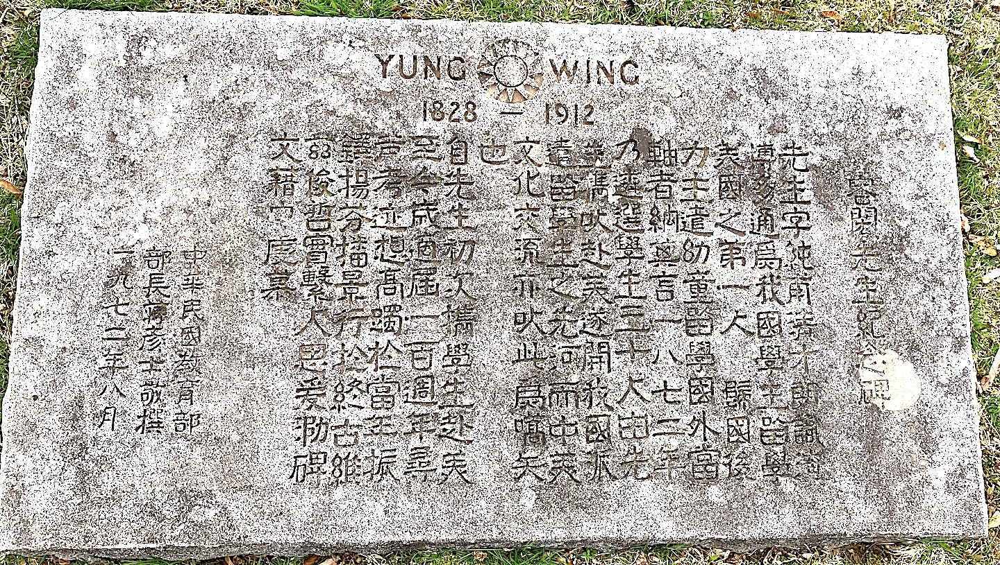

# 容闳先生和西学东渐

追访容闳先生的遗迹，和一些杂谈。

### 容闳夫妇和子孙的墓地


Tombs of Yung family at the Cedar Hill Cemetery. Husband and wife on the front, offsprings the right.

### 纪念碑文



先生纪念碑，立于晚清幼童留学100周年。东西文化真正交流的开始。
```
容閎先生紀念碑
先生字純甫，清才朗識，淹博多通，為我國學生留學美國之第一人。
歸國後，力主遣幼童留學國外，當軸者納其言。
一八七二年乃遴選學生三十人，由先生攜以赴美，遂開我國派遣留學生之先河。
而中美文化交流，亦以此為嚆矢也。
自先生初次攜學生赴美，至今適屆一百周年。
尋聲考跡，想高躅于當年；振鐸揚芬，播景行於終古。
維茲俊哲，實系人思。爰泐碑文，借申虔慕。
中華民國教育部部長蔣彥士敬撰
一九七二年八月
```

### External links

https://zh.wikipedia.org/wiki/%E5%AE%B9%E9%97%B3

https://en.wikipedia.org/wiki/Yung_Wing


