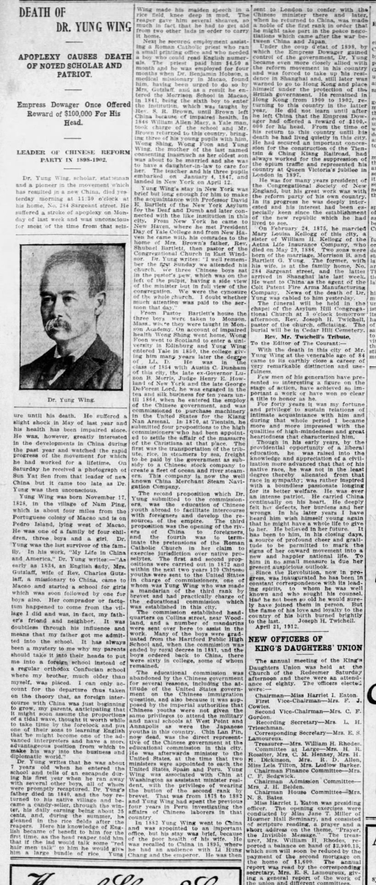
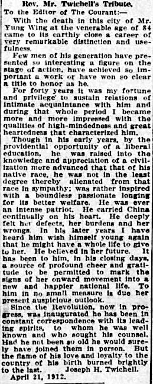

# DEATH OF DR. YUNG WING, Hartford Courant, Aprill 22, 1912

src: https://www.newspapers.com/article/hartford-courant/81019284/

Retrieved July 4, 2024.

**OCR, with errors**

DEATH OF DR. YUNG WING 

APOPLEXY CAUSES DEATH OF NOTED SCHOLAR AND PATRIOT. 

Empress Dowager Once Offered Reward of $100,000 For His Head. 

LEADER OF CHINESE REFORM PARTY IN 1898-1902. 

Dr. Yung Wing, scholar, statesman and a pioneer in the movement which has resulted a new China, died yesterday morning at 11:30 o'clock at his home, No. 284 Sargeant street. He suffered a stroke of apoplexy on Monday of last week and was unconscious for most of the time from that seizure until his death.

He suffered a slight shock in May of last year and his health has been impaired since. He was, however, greatly interested in the developments in China during the past year and watched the rapid progress of the movement for which he had worked for a lifetime. On Saturday he received a photograph of Sun Yat Sen from that leader of new China but it came too late as Dr. Yung was then unconscious. Yung Wing was born November 17, 1828, in the village of Nam Ping, which is about four miles from the Portuguese colony of Macao and is on Pedro Island, lying west of Macao.

He was one of a family bf four children, three boys and 1 a girl, Dr. Yung was the last survivor of the fam. ily. In his work, "My Life in China and America," Dr. Yung writes:-"As early as 1834, an English dady, Mrs.

Gutzlaff, wife of Rev. Charles Gutzlaff, a missionary to China, came to Macao and started a school for girls which was soon followed by one for boys also. Her comprador or factotum happened to come from the village I did and was, in fact, my father's friend and neighbor. It was doubtless through his influence and means that my father got me admitted into the school. It has always been a mystery to me why my parents should take it into their heads to put me into a foreign school Instead of a regular orthodox Confucian school where my brother, much older than myself, was placed.

I can only account for the departure thus taken on the theory that, as foreign intercourse with China was just beginning to grow, my parents, anticipating that it might soon assume the proportions of a tidal wave, thought it worth while to take time by the forelock and put one of their sons to learning English that he might become one of the advanced interpreters and have a more advantageous position from which to make his way into the business and diplomatic world." Dr. Yung writes that he was about 7 years old when he entered the school and tells of an escapade during his first year when he ran away with several other boys, all of whom were promptly recaptured. Dr. Yung's father died in 1840, and the boy returned to his native village and became a candy-seller, through the winter, his daily earning being about 25 cents, and, during the summer, he gleaned in the rice fields after the reapers. Here his knowledge of English became of benefit to him for the first time, as the head reaper told him that if the lad would talk some "red hair men talk* to him he would give him a large bundle of rice.

Yung Wing made his maiden speech in a rice field, knee deep in mud, The reaper gave him several sheaves, so much in fact that he had to get aid from two other lads in order to carry it home. Nest he secured employment assisting a Roman Catholic priest who ran small printing office and who needed a boy who could read English numerals, The priest paid him $4.50 a month and he was employed for four months when Dr. Benjamin Hobson, a medical missionary in Macao, found him, having been urged to do so by Mrs. Gutzlaff, and as a result he entered the Morrison School in Macao, in 1841, being the sixth boy to enter the institution, which was taught by Rev. S.

R. Brown, until Brown left China because cf impaired health. In 1846 William Allen Macy, a Yale man, took charge of the school and Mr. Brown returned to this country, bringing three his young pupils with him, Wong Shing, Wong Foon and Yung Wing, the mother of the last named consenting inasmuch as her oldest son was about to be married and she was to have a daughter-in-law to care for her. The teacher and his three pupils embarked on January 4, 1847, and landed in New York on April 12.

brief Yung Wing's stay in New York was but long enough for him to make the acquaintance with Professor David E, Bartlett of the New York Asylum for the Deaf and Dumb and later connected with the like institution in this city. From New York he came to New Haven, where he met President Day of Yale College and from New Haver he came with his comrades to the home of Mrs. Brown's father, Rev. Shubael Bartlett, then pastor of the Congregational Church in East Windsor. Dr.

Yung writes: "I well remember the first Sunday we attended his church. We three Chinese boys sat in the pastor's pew, which was on the left of the pulpit, having a side view of the minister but in full view of the congregation. We were the cynosure of the whole church. I doubt whether much attention was paid to the sermon that day." From Pastor Bartlett's the three boys were taken to Monson, Mass., wire they were taught in Monson Academy. On account of impaired health Wong Shing went home, Wong Foon went to Scotland to enter a university in Edinburg and Yung Wing entered Yale in 1850, the college giving him many years later the degree of LL.

D. He was in the class of 1854 with Austin C. Dunham of this city, the late ex-Governor Luzon B. Morris, Judge Henry E. Howland of New York and the late George DeForest Lord, he was engaged in the tea and silk business for ten years until 1864, when he entered the employ of the Chinese government, and was commissioned to purchase machinery in the United States for the Kiang Nan Arsenal.

In 1870, at Tientsin, he submitted four propositions to the high commissioners who had been appointed to settle the affair of the massacre of the Christians at that place. The first was the transportation of the tribute, rice, in steamers by sea, freight to be paid by the government as subsidy to a Chinese stock company to create a fleet of ocean and river steamers. This company is. now the well known China Merchant Steam Navigation Company. The second proposition which Dr.

Yung submitted to the commissioners. was the education of Chinese youth abroad to facilitate intercourse with foreigners and develop the resources of the empire. The third proposition was the opening of the riverg of China to foreigners. and the fourth was terminate the pretensions of the Roman Catholic Church in her claim to exercise jurisdiction over native proselytes. The first and second propositions were carried out in 1872 and within the next two years 120 Chinese youths were sent to the United States in charge of commissioners, one of whom was Yung Wing who was made a mandarian of the third rank by brevet and had practically charge the educational commission which was established in this city.

The commission established headquarters Collins street, near Woodland, and 8 number of mandarins were sent over here to assist in the work. Many of the boys were graduated from the Hartford Public High School and, when the commission was ended by royal decree in 1881, and the boys ordered back to China, there were sixty in college, some of whom remained. •The educational commission was abandoned by the Chinese government for several reasons, including the attitude of the United States government on the Chinese immigration question, and also because it was sup. posed by the imperial authorities that Chinese youths were not given the same privileges to attend the military and naval schools at West Point and Annapolis 88 were Japanese youths in this country. Chin Lan Pin, now dead, was the direct representtive of the Chinese government at the educational commission in this city.

He was afterwards minister to the United States, at the time that two ministers were appointed to each the United States, Spain and Peru. Yung Wing was associated with Chin at Washington as assistant minister resident, with the privilege of wearing the button of the second rank by brevet. That was from 1879 to 1882 and Yung Wing had spent the previous four years in Peru investigating the affairs of Chinese laborers in that country. In 1882 Yung Wing went to China and was appointed to an Important office, but his stay was brief, because of the poor health of his wife. He was recalled to China in 1895, where he had an audience with Li Hung Chang and the emperor.

1 He was then sent to London to confer with the Chinese minister there and later, when he returned to China, was made a noble of the first rank in order that he might take part in the peace negotiations which came after the war between China and Japan, Under the coup d'etat of 1838, by which the Empress Dowager gained control of the government, Dr. Yung became even more closely allied with the reform movement in his country and was forced to take up his residence in Shanghai and, still later was warned to go to Hong Kong and place himself under the protection of the British government. He remained in Hong Kong from 1900 to 1902, returning to this country in the latter year, He did not learn until after he left China that the Empress Dowager had offered a reward of $100,000 for his head. From the time of his return to this country until his death he had lived quietly in this city. He had secured an important concession for the construction of the Tientsin &amp; Ching Kiang Railroad, had always worked for the suppression of the opium traffic and represented his country at Queen Victoria's jubilee in London in 1897.

He was for many years president of the Congregational Society of New England, but his great work was with the reform party of his own country. In its progress he was deeply interested and his interest had been especially keen since the establishment of the new republic which he had lived to see. On February 24, 1875, he married Mary Louisa Kellogg of this city, a sister of William H. Kellogg of the Aetna Life Insurance Company, who died on May 29, 1886, Two sons were born of the marriage. Morrison B.and Bartlett G. Yung. The former, with his wife, is at the family home, No. 284 Sargeant street, and the latter arrived in Shanghai late last week. He went to China as the agent of the Colt Patent Fire Arms Manufacturing Company.

News of the death of Dr. Yung was cabled to n him yesterday, The funeral will be held d in the chapel of the Asylum Hill Congregational Church at 3 o'clock tomorrow afternoon, Rev. Joseph H. Twichell, pastor of the church, officiating. The burial will be in Cedar Cemetery.

### Rev. Mr. Twichell's Tribute. 

To the Editor of The Courant: 

With the death in this city of Mr. Yung Wing at the venerable age of 84 came earthly close a career of very remarkable distinction and usefulness.

Few men of his generation have presented so interesting a figure on the stage of action, have achieved so important a work or have won so clear a title to honor as he. For forty years it was fortune and privilege to sustain relations of intimate acquaintance with him and during that whole period I became more and more impressed with the qualities of high-mindedness and great heartedness that characterized him. Though in his early years, by the providential opportunity of a liberal education, he was raised into the knowledge and appreciation of a civilization more advanced that that of his native race, he was not in the least degree thereby alienated from that race in sympathy; was rather Inspired with a boundless passionate longing for its better welfare. was ever an intense patriot. He carried China continually on his heart.

He deeply felt her defects, her burdens and her wrongs. In his later years I have heard him wish himself young again that he might have a whole life to give to her. He believed in her future. It hag been to him, in his closing days, a source of profound cheer and gratitude to be permitted to mark the signs of her onward movement into a new and happier national life. To him in no small measure is due her present auspicioua outlook.

Since the Revolution, now in progress, wag Inaugurated he has been in constant correspondence with its leading spirits, to whom he was well known and who sought his counsel. Had he not been so old he would surely have joined them in person. But the flame of his love and loyalty to the country of his birth burned brightly to the last. Joseph H. Twichell.

